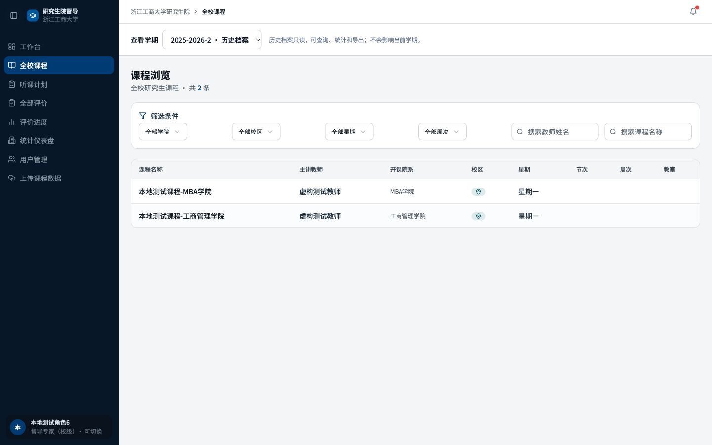
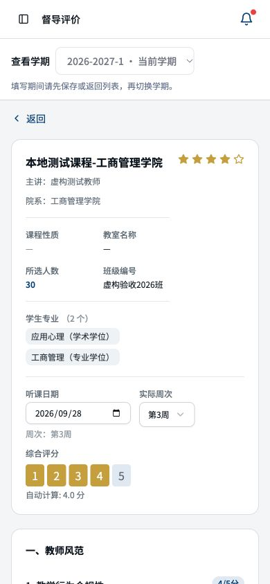
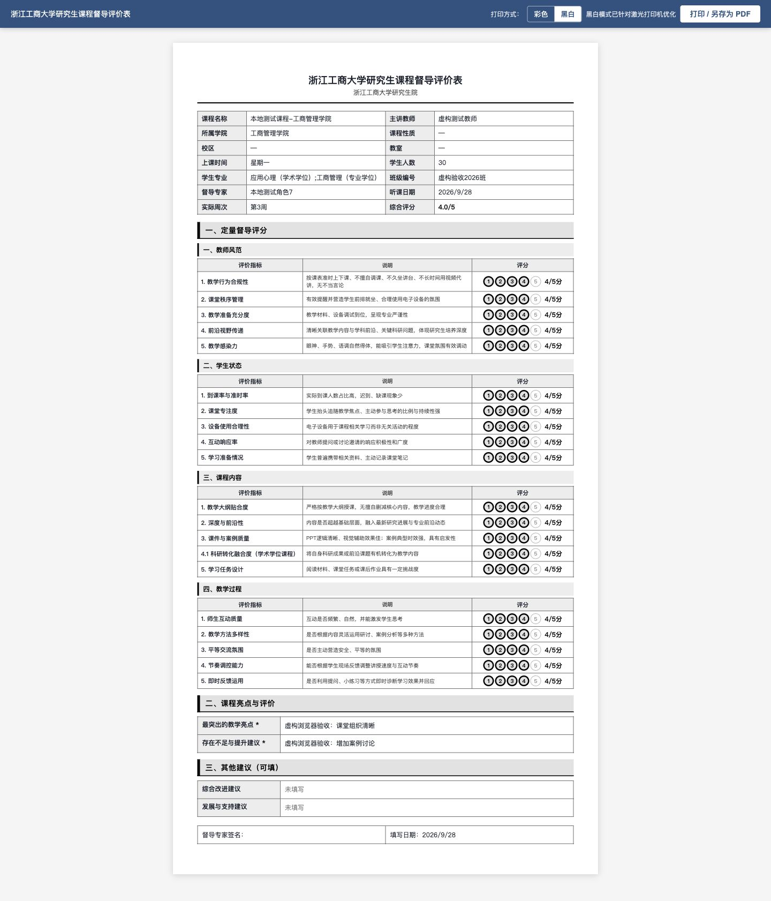
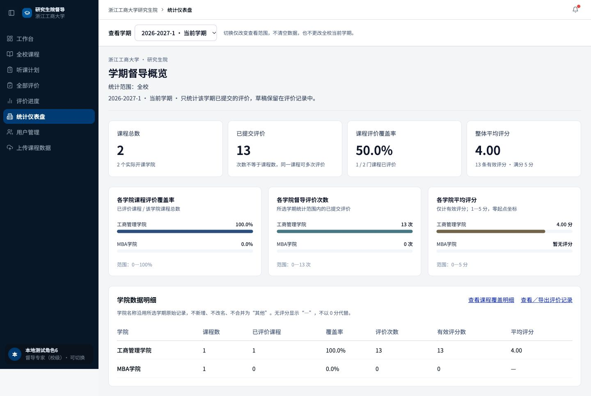

# 浙江工商大学研究生院督导评价系统V3操作手册

供督导教师、学院教学秘书、学院分管领导及研究生院管理人员使用。登录后先核对“查看学期”和身份，再按本人职责操作。截图使用本地虚构账号，截图中的数量不是学校实际业务数据。

## 登录和账号

使用教工工号登录。初始或重置密码必须先修改，完成后重新登录；未改密不能浏览业务、导出或打印。忘记密码、账号停用或学院信息错误时，联系研究生院管理员。系统不要求普通业务用户注册账号。

## 各角色可以做什么

| 角色 | 课程与本人评价 | 管理范围 |
| --- | --- | --- |
| 校级督导 | 浏览全校课程，创建本人计划、草稿和评价 | 查看本人评价 |
| 院级督导 | 浏览本院课程，创建本人计划、草稿和评价 | 查看本人评价 |
| 教学秘书 | 查询本院课程和评价，不评分 | 本院统计与进度，无账号管理 |
| 学院分管领导 | 院级督导和学院管理两个视图 | 本院统计和评价，不跨院 |
| 研究生院主管 | 查询全校课程，可创建本人计划和评价 | 全校统计、人员、学期、上传 |
| 傅培华组合 | 主管和校级督导两个视图 | 保留全校管理能力 |
| 技术管理员 | 全校业务与维护 | 技术账号另计 |

正式名单100人，26位双身份（傅培华及25位学院分管领导）。切换左下角身份只改变工作台显示，不改变评价作者、所属学院或已授权功能。学院领导切到学院管理后仍可进入听课计划和评价；秘书没有评分能力。

## 查看不同学期

页面上方“查看学期”选择2025-2026-2或2026-2027-1。课程、计划、评价和统计跟随选择；历史提示“档案只读”，可以查询、导出和打印。切换查看不会清空历史、改变全校当前学期或把旧评价计入新学期。新学期没有评价时显示0次，无评分显示“—”。评分填写期间先保存或返回列表再切换。

## 安排听课和填写评价

1. 在课程列表筛选学院、校区、星期或周次，核对课程、教师、专业、教室和时间，点击“听课”。
2. 选择计划周次并加入计划。尚未关联评价的待听课计划可点击“修改计划”调整周次和备注；草稿或正式评价已经关联后不可改动计划。已占用的周次不可重复选择；未指定周次的计划，填写评价时自行核对实际日期。
3. “听课计划”进入“填写评价”。所选计划及计划周次会带入评分表，日期先显示该周周一；按实际听课日期修改，周次自动对应。2026年秋季第一周从9月14日开始。
4. 填写各项评分，课程内容4.1和4.2按学术/专业学位二选一，填写必填亮点及建议。选填项可留空。
5. 未完成时“保存草稿”，以后在评价记录中继续编辑。完成全部必填项后“提交评价”；不完整评价不能正式提交。
6. 提交后查看本人详情；匹配计划变为“已评价”。本人的当前学期评价可按授权修改，历史评价只读。

手机浏览器可使用同样流程。表头显示课程性质、班级及学生专业；专业原表未提供时显示“—”，不补造内容。异常排课周次由管理员核查后再安排听课。

## 查看和打印评价

评价列表点击“查看评价详情”，核对所属学期、作者、听课日期、周次、评分和评语。校级/院级单身份督导只看本人记录；学院管理人员可看本院，研究生院管理人员可看授权全校范围。

“导出记录”可导出Excel或打开“打印 / 导出PDF”。打印页面可切换“彩色”“黑白”，再使用浏览器“打印 / 另存为PDF”。黑白模式以深色数字和粗圆环显示评分，页面保留原评语。草稿不作为正式打印报表。若新窗口被浏览器拦截，允许本系统的打印窗口后再次点击。

## 查看统计和维护资料

统计只计算所选学期已提交的评价。课程总数、已评价课程、评价次数分别显示；同一门课程多次评价只增加次数，不重复增加覆盖课程数。三张图为覆盖率、评价次数、平均评分。学院领导及秘书只看本院，不拥有全校统计。

研究生院管理人员使用“用户管理”新增、重置、停用、启用账号，并核对主角色、附加角色、学院和督导范围；停用保留历史作者关系。教学秘书管理本院账号暂缓。

“上传课程数据”分MBA与非MBA入口，先预览、核对目标学期及警告，再确认导入；预览变化或过期时重新上传。已关联计划/评价的课程保护，未上传课程及历史保留。新学期配置和导入流程见《换学期与课表导入操作手册》。不要使用初始化、清表或旧命令行写入工具换学期。

## 使用时遇到问题

记录操作页面、所选学期和错误提示，联系研究生院管理员。不要发送密码、会话或完整敏感评价截图。MBA原表第一周之前的场次及缺教师记录等待核查，不能自行把学校第一周改为9月7日。公网地址与学校域名以正式发布通知为准。
